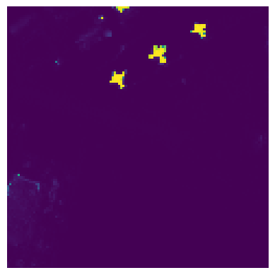
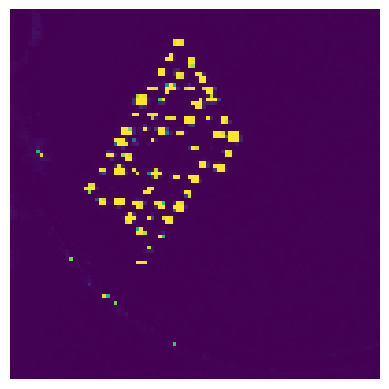
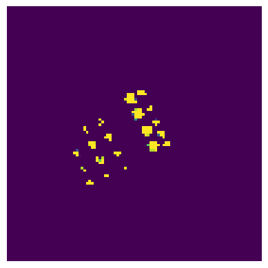
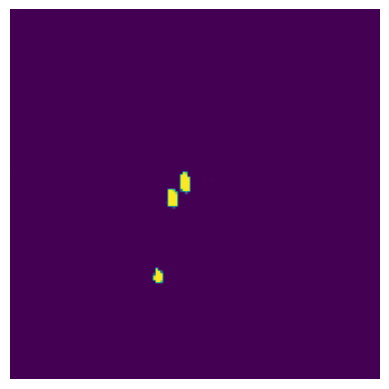

# SBSNet: Spatial–Spectral Background–Target Separation Network for Hyperspectral Target Detection

Official PyTorch implementation of **SBSNet**, published in *IEEE Journal of Selected Topics in Applied Earth Observations and Remote Sensing (JSTARS)*, 2026.

> Jianlin Xiang, Yanshan Li, Linhui Dai, Ruo Qi, Haojin Tang, Li Zhang, Kunhua Zhang, and Weixin Xie, “SBSNet: Spatial–Spectral Background–Target Separation Network for Hyperspectral Target Detection,” *IEEE JSTARS*, vol. 19, pp. 8648–8663, 2026.

[[Paper](./SBSNet_SpatialSpectral_BackgroundTarget_Separation_Network_for_Hyperspectral_Target_Detection.pdf)] [[DOI](https://doi.org/10.1109/JSTARS.2026.3665707)] [[Datasets & Checkpoints](https://huggingface.co/buckets/xjlDestiny/SBSNet)]

## Introduction

Hyperspectral target detection (HTD) locates targets in a hyperspectral image using limited prior target spectra. Existing contrastive-learning methods can be affected by impure target/background sample sets and severe class imbalance. SBSNet addresses these issues by constructing high-purity samples from an unlabeled HSI and learning a feature space with stronger background–target separability.

The method contains the following components:

- **Local Spatial–Spectral Feature Fusion Module (LSFFM):** integrates a pixel spectrum with spectrally correlated neighboring pixels.
- **Spatial–Spectral Pseudolabel Purification Strategy (SPPS):** applies ACE coarse detection and an adaptive threshold to construct target/background pixel sets. The resulting pseudolabel map also supervises checkpoint selection during training.
- **AE-based Sample Generation Strategy (AESGS):** uses the autoencoder reconstruction process and sample screening to generate diverse target/background spectra and reduce class imbalance.
- **Multiscale Spatial–Spectral Autoencoder (MSSAE):** uses three convolution branches with kernel sizes 7, 5, and 3. Each branch contains convolution–attention mixed blocks (CAMBs) combining channel attention (SE) and spectral attention (Transformer Encoder).
- **Clustered Adaptive Focus Training Strategy (CAFTS):** performs similarity-based clustered sampling and optimizes the model with adaptive exponential weighted loss (AEW-Loss), emphasizing difficult target and background samples.

The complete workflow implemented by the training entry point is:

```text
HSI + prior target spectrum
        │
        ├── LSFFM ── spatial–spectral HSI
        │
        ├── averaging + ACE + adaptive threshold ── pseudolabel map (SPPS)
        │
        ├── target/background extraction + MSSAE reconstruction ── augmented samples (AESGS)
        │
        └── clustered sampling + AEW-Loss ── SBSNet training and best encoder
```

## Qualitative Results

| SanDiego-1 | Airport-2 | Beach-2 | Urban-2 | Qingpu-1 |
|:---:|:---:|:---:|:---:|:---:|
|  |  |  |  |  |

## Environment

The experiments reported in the paper used **Python 3.9**, **PyTorch 2.3.0**, and one **NVIDIA RTX 3090 GPU**. Other compatible PyTorch/CUDA environments may also work.

```bash
conda create -n sbsnet python=3.9 -y
conda activate sbsnet

# Install the PyTorch build matching your CUDA environment first.
pip install torch==2.3.0
pip install numpy matplotlib opencv-python scikit-learn torchinfo tqdm thop
```

`scipy` and `spectral` are additionally required only when using the ENVI/MAT conversion utilities under `dataset/`:

```bash
pip install scipy spectral
```

## Repository Structure

```text
SBSNet/
├── dataset/                                            # hyperspectral data and ground truth
├── log/                                                # released checkpoints and detection maps
├── models/
│   ├── MSSAE.py                                       # MSSAE, encoder, decoder, CAMB
│   ├── detector.py                                    # classical detectors, including ACE
│   └── ...
├── train-abu-urban-2-DataAugment-AddCornerPointData-3-norm.py
│                                                        # end-to-end Urban-2 training entry point
├── eval.py                                             # evaluation/inference entry point
├── Train_Test_norm.py                                  # sample generation and training loops
├── myDataset.py                                        # clustered sampling and data loader
├── loss_function_norm.py                               # reconstruction and AEW losses
├── setting.py                                          # shared model/training hyperparameters
├── utils.py                                            # preprocessing, LSFFM, metrics, visualization
└── SBSNet_SpatialSpectral_BackgroundTarget_Separation_Network_for_Hyperspectral_Target_Detection.pdf
```

## Data and Pretrained Models

The datasets and pretrained `.pth` files are not hosted directly in the GitHub repository because of their size. Download them from the [SBSNet Hugging Face bucket](https://huggingface.co/buckets/xjlDestiny/SBSNet), then place them under the repository root while preserving the `dataset/` and `log/` paths shown below.

Hugging Face buckets can also be downloaded with a recent version of `huggingface_hub`:

```bash
pip install -U huggingface_hub
hf buckets sync hf://buckets/xjlDestiny/SBSNet .
```

The five datasets used in the paper map to the released files as follows. Note that **SanDiego-1 is named `AVIRIS-I` in the evaluation code and released checkpoint filenames**.

| Dataset in paper | HSI file | Ground-truth file | LSFFM window | AEW-Loss α | Pretrained encoder |
|---|---|---|:---:|:---:|---|
| SanDiego-1 | `dataset/AVIRIS/AVIRIS-I.npy` | `dataset/AVIRIS/AVIRIS-I-gt.npy` | 5 | 0.8 | `log/SBSNet_AVIRIS-I_encoder.pth` |
| Airport-2 | `dataset/Abu-airport/Abu-airport-2.npy` | `dataset/Abu-airport/Abu-airport-2-gt.npy` | 5 | 0.8 | `log/SBSNet_Abu-airport-2_encoder.pth` |
| Beach-2 | `dataset/Abu-beach/abu-beach-2.npy` | `dataset/Abu-beach/abu-beach-2-gt.npy` | 3 | 0.5 | `log/SBSNet_abu-beach-2_encoder.pth` |
| Urban-2 | `dataset/Abu-urban/abu-urban-2.npy` | `dataset/Abu-urban/abu-urban-2-gt.npy` | 3 | 0.2 | `log/SBSNet_abu-urban-2_encoder.pth` |
| Qingpu-1 | `dataset/Qingpu/Qingpu-I.npy` | `dataset/Qingpu/Qingpu-I-gt.npy` | 3 | 0.8 | `log/SBSNet_Qingpu-I_encoder.pth` |

Only the HSI and ground-truth `.npy` pair for the selected scene is required at runtime. The released implementation uses the ground truth in `tsGeneration(...)` to form the prior target spectrum and to report evaluation metrics; `type_target_spectrum = 2` retains the 80% of target spectra closest to their mean in spectral-angle distance and averages them.

## Training

The provided training entry point reproduces the **Urban-2** experiment. It already includes all preprocessing and data-generation stages; there is no need to run `myDataAugmentAddCornerPointData-abu-urban.py` beforehand.

1. Check the following paths and settings in `train-abu-urban-2-DataAugment-AddCornerPointData-3-norm.py`:

   ```python
   device = torch.device('cuda:3' if torch.cuda.is_available() else 'cpu')
   HSI_DATA_PATH = "dataset/Abu-urban/abu-urban-2.npy"
   HSI_GT_PATH = "dataset/Abu-urban/abu-urban-2-gt.npy"
   window_size = 3
   alaf = 0.2  # α in AEW-Loss
   ```

   Change the CUDA index to an available GPU if necessary.

2. Start the complete pipeline from the repository root:

   ```bash
   python train-abu-urban-2-DataAugment-AddCornerPointData-3-norm.py
   ```

On the first run, the script performs the following operations automatically:

1. Global min–max normalization and prior target-spectrum generation.
2. LSFFM construction with a `3 × 3` neighborhood.
3. ACE coarse detection, adaptive thresholding, and pseudolabel generation.
4. MSSAE-based target/background sample generation.
5. Similarity-based clustering into 10 target and 10 background groups.
6. SBSNet training for 200 epochs and pseudolabel-guided best-checkpoint selection.

The very large `num_epochs` value used inside `dataAugment(...)` is an upper bound. Sample generation stops early once the requested number of accepted reconstructions is reached.

Generated samples are cached in:

```text
log/train-abu-urban-2-DataAugment-AddCornerPointData-3-norm/MSSAE/dataAugment/
├── 3_3_hsi_t_all_augmented.npy
├── 3_3_hsi_b_all_augmented.npy
├── encoder.pth
└── decoder.pth
```

If `encoder.pth` exists, subsequent runs reuse the two augmented `.npy` files. Therefore, keep these cached files together; remove or relocate all four if sample generation needs to be restarted.

Training logs, visualizations, and the selected weights are written to a hyperparameter-specific subdirectory under:

```text
log/train-abu-urban-2-DataAugment-AddCornerPointData-3-norm/MSSAE/
```

The primary outputs are `best_encoder.pth`, `best_decoder.pth`, `training.log`, and the files in `outputDisplay/`.

### Main Training Configuration

| Setting | Value |
|---|---:|
| Random seed | 23 |
| Target/background clusters | 10 each |
| Samples drawn per cluster | 64 |
| Epochs | 200 |
| Optimizer | Adam |
| Initial learning rate | 1e-4 |
| Weight decay | 0 |
| LR schedule | StepLR, step size 20, γ = 0.75 |
| Mapped spectral length | 128 |
| Feature channels (`d_model`) | 32 |
| CAMBs per branch | 2 |
| Transformer depth / heads / hidden size | 1 / 2 / 128 |
| Encoder/decoder loss balance (`encode_f`) | 0.8 |

To train another scene, copy the Urban-2 entry point and change the HSI/GT paths, `window_size`, `alaf`, and output-identifying filename. Use the scene-specific values in the dataset table above.

## Evaluation

The evaluation script uses one pretrained encoder at a time.

1. Open `eval.py` and set the device, checkpoint, scene paths, and LSFFM window. For example, to evaluate Urban-2:

   ```python
   device = torch.device('cuda:0' if torch.cuda.is_available() else 'cpu')
   encoder_path = 'log/SBSNet_abu-urban-2_encoder.pth'

   window_size = 3
   HSI_DATA_PATH = 'dataset/Abu-urban/abu-urban-2.npy'
   HSI_GT_PATH = 'dataset/Abu-urban/abu-urban-2-gt.npy'
   ```

2. Run:

   ```bash
   python eval.py
   ```

The script reports model FLOPs/parameters, testing time, and the five metrics used in the paper:

- `auc_ft`: AUC(Pf, Pd)
- `auc_t`: AUC(τ, Pd)
- `auc_f`: AUC(τ, Pf)
- `auc_oa`: `auc_ft + auc_t - auc_f`
- `auc_snpr`: `auc_t / auc_f`

The detection map is saved in both `.png` and `.npy` formats in the same directory as `encoder_path`. In the current `eval.py`, these files use the prefix `BTSNet_`.

## Citation

If this work is useful in your research, please cite:

```bibtex
@article{xiang2026sbsnet,
  title   = {SBSNet: Spatial--Spectral Background--Target Separation Network for Hyperspectral Target Detection},
  author  = {Xiang, Jianlin and Li, Yanshan and Dai, Linhui and Qi, Ruo and Tang, Haojin and Zhang, Li and Zhang, Kunhua and Xie, Weixin},
  journal = {IEEE Journal of Selected Topics in Applied Earth Observations and Remote Sensing},
  volume  = {19},
  pages   = {8648--8663},
  year    = {2026},
  doi     = {10.1109/JSTARS.2026.3665707}
}
```

## Contact

For questions about the paper or code, please open an issue or contact Jianlin Xiang at `xiangjianlin2023@email.szu.edu.cn`.
